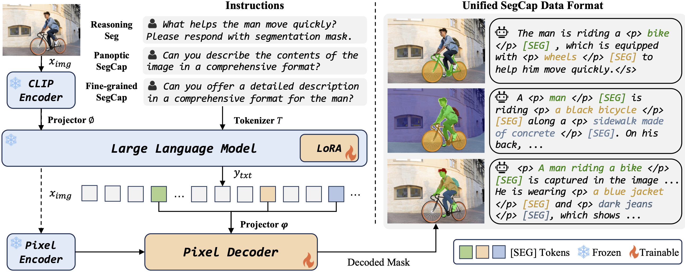
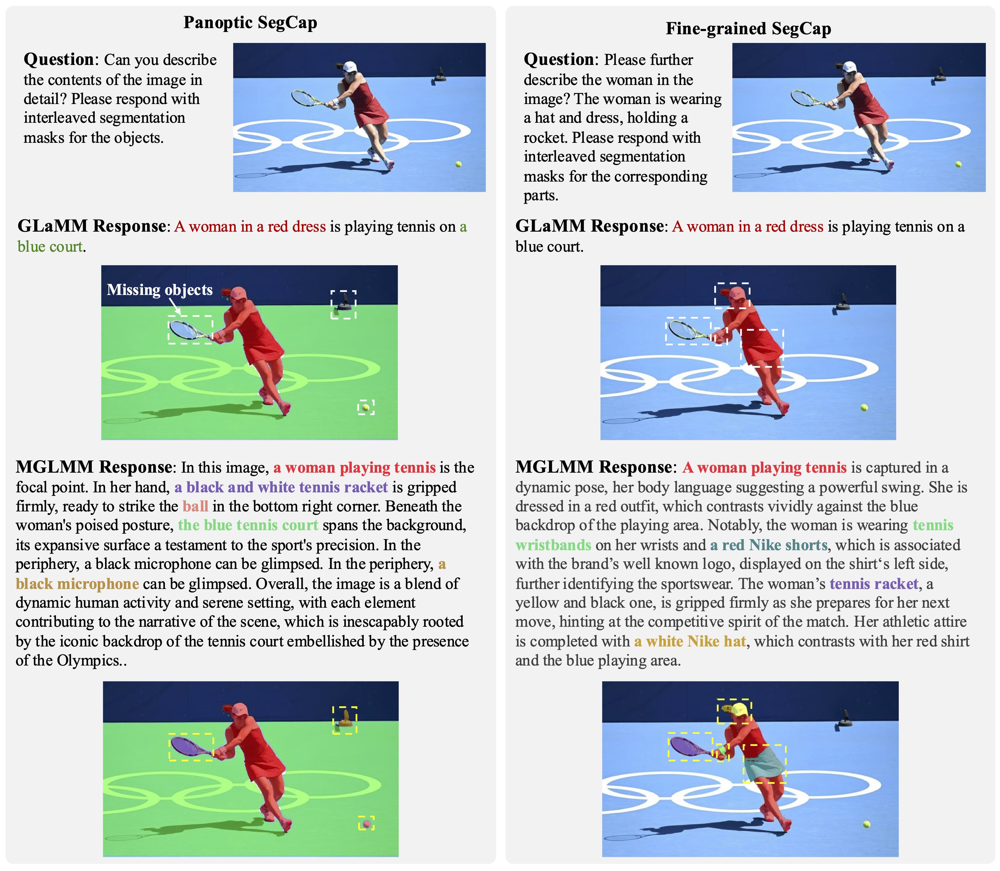
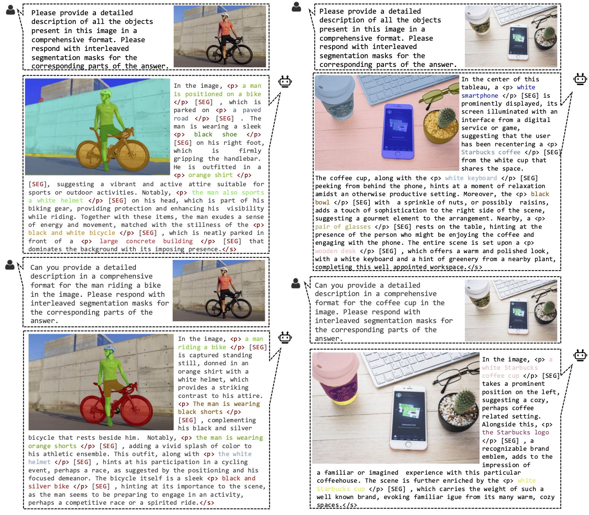
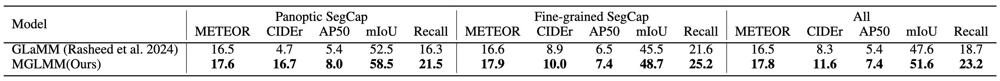
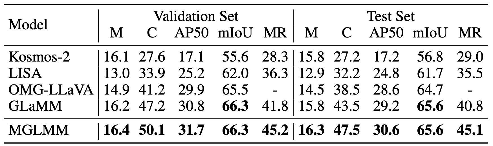
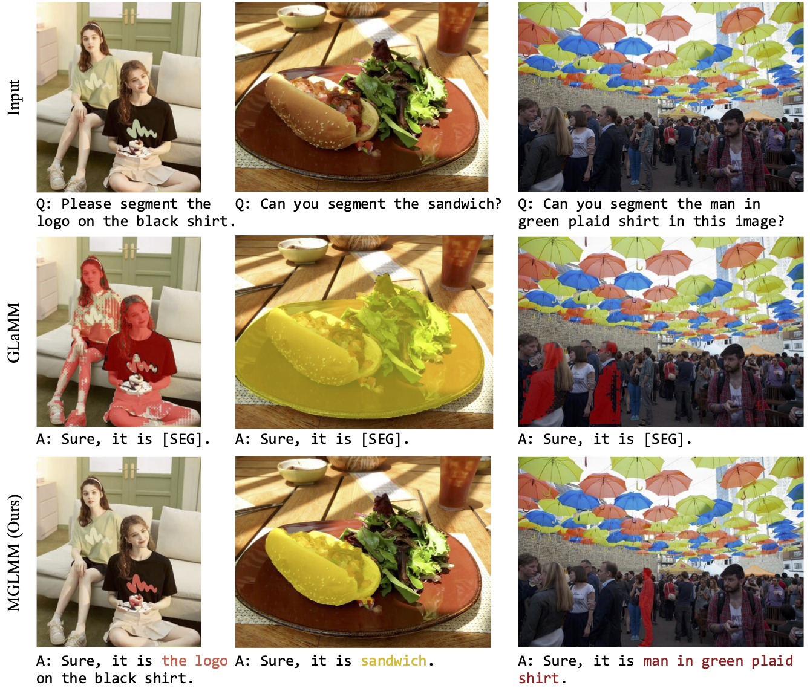
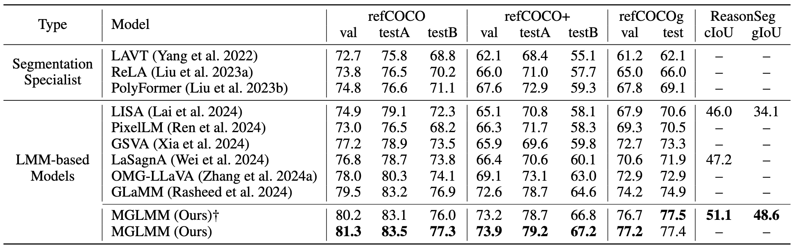
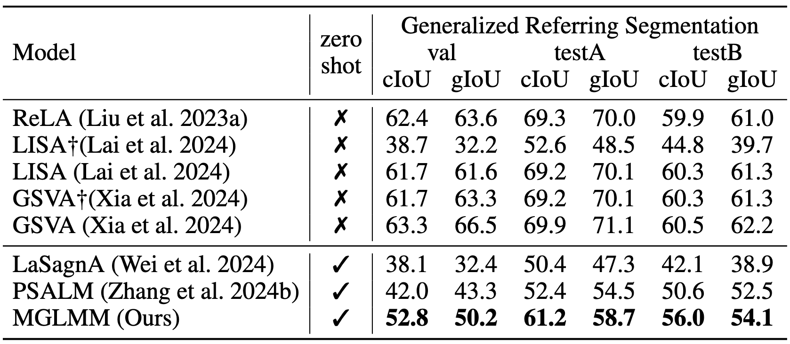
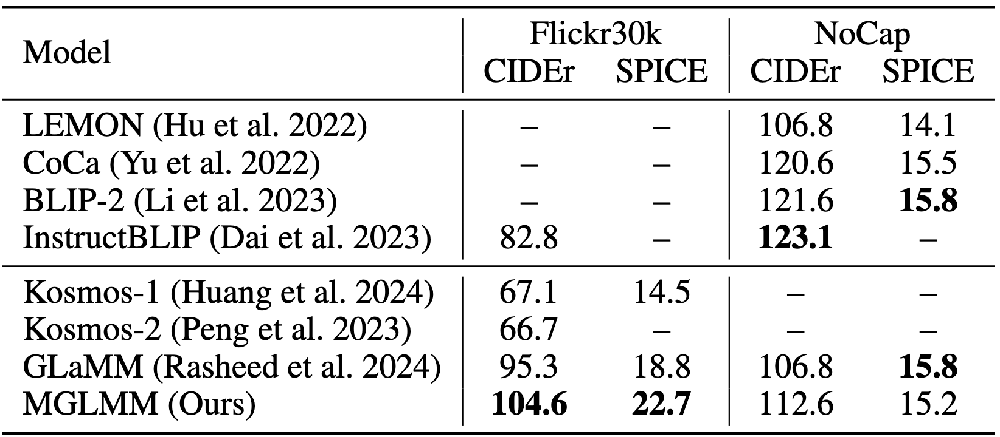

# Instruction-guided Multi-Granularity Segmentation and Captioning with Large Multimodal Model
<p align="center">
    
</p>

#### Li Zhou\*, Xu Yuan\*, Zenghui Sun, Zikun Zhou, Jinsong Lan
\* Equally contributing first authors


#### **TAO Technology of Alibaba Group, The Hong Kong Polytechnic University, Peng Cheng Laboratory**
[]()
[]()
[](https://lizhou-cs.github.io/mglmm.github.io)
[]()
---

## 📢 Latest Updates

- 🌟 **Featured**: We will release the MGLMM demo, code and datasets as soon as possible. 🌟

---

##  MGLMM Overview

<!-- Large Multimodal Models (LMMs) have achieved significant progress by extending large language models. Building on this progress, the latest developments in LMMs demonstrate the ability to generate dense pixel-wise segmentation through the integration of segmentation models.  -->
The pixel-wise understanding capability of existing Large Multimodal Models (LMMs) remains at the instance level, showing the limited ability to generate fine-grained textual responses and segmentation masks even provided with detailed instruction cues.
To overcome this limitation, we introduce a Multi-Granularity Large Multimodal Model (MGLMM), which is capable of seamlessly adjusting the granularity of Segmentation and Captioning (SegCap) following user instructions, from panoptic SegCap to fine-grained SegCap. 
We name such a new task Multi-Granularity Segmentation and Captioning (MGSC). Observing the lack of a benchmark for model training and evaluation over the MGSC task, we establish a benchmark with aligned masks and captions in multi-granularity using our customized automated annotation pipeline. This benchmark comprises 10K images and more than 30K image-question pairs.
We will release our dataset along with the implementation of our automated dataset annotation pipeline for further research. Besides, we propose a novel unified SegCap data format to unify heterogeneous segmentation datasets; it effectively facilitates learning to associate object concepts with visual features during multi-task training. 
 <!-- Extensive experiments demonstrate that our MGLMM excels at tackling more than eight downstream tasks and achieves state-of-the-art performance in MGSC, GCG, image captioning, referring segmentation, multiple and empty segmentation, and reasoning segmentation tasks.  -->
 <!-- The great performance and versatility of MGLMM underscore its potential impact on advancing multimodal research. -->

<p align="center">
  
</p>


---

## 🏆 Contributions

- **MGLMM Introduction.** We propose the Multi-Granularity Large Multimodal Model (MGLMM), the first model capable of seamlessly switching between multi-granularity segmentation and captioning, mainly including panoptic and fine-grained segmentation and captioning. MGLMM achieves state-of-the-art performance on multiple downstream tasks.

- **Novel Task & Evaluation.** We introduce a novel benchmark MGSCData to train and evaluate the ability of multi-granularity segmentation and captioning for LMMs, which comprises over 30K high-quality image-question pairs.

- **Unify Data Format.** We propose a unified data format, which facilitates learning the alignment relationships between object concepts and segmentation masks in multiple granularities.

---

## 👁️💬 MGLMM: Multi-granularity Large Multimodal Model
The left side of the figure illustrates the model architecture of MGLMM, and the right side illustrates the proposed unified data format for multi-task learning.

<p align="center">
  
</p>

---

### 💡 Motivation
The left figure shows a case where the previous work (e.g., GLaMM) overlooks the tennis racket, tennis ball, and microphone in mask and text responses. Besides, these models only possess the ability to describe the image at the instance level and produce corresponding instance masks aligned with the output texts. Hence, these models can hardly perceive the fine-grained objects, such as the player's hat, wristband, and skirt in the right figure, even provided with detailed textual cues. The missing of the above abilities would limit the universality and comprehension of the LMMs.

<p align="center">
  
</p>

---

### 🔍 Multi-granlarity Segmentation and Captioning Dataset (MGSCData)

We annotate 10K SAM images, which are inherently diverse and exhibit multi-granularity. The resulting dataset comprises 30K conversations and contains over 45M tokens, totaling more than 300K segmentation masks, each accompanied by a short semantic label and a detailed caption. 

<p align="center">
  
</p>
<!-- --- -->

## 🚀 Qualitative and Quantitative results

### 📷 Multi-Granularity Segmentation and Captioning (MGSC)

The MGSC task aims to evaluate the ability of LMMs to seamlessly adjust the granularity of segmentation and captioning.

<center>
  
</center>

<center>
  
    <div style="display: inline-block; color: #999; padding: 2px;">
      Performance on multi-granularity segmentation and captioning. We compare our model with GLaMM using METEOR, CIDEr, AP50, mIoU, and mask recall metrics.
  </div>
</center>

---

### 📷 Grounded Conversation Generation (GCG)
The GCG task proposed by GLaMM primarily focuses on aligning the textual response with the segmentation mask at the instance level. In comparison to previous models, MGLMM provides high-quality and fine-grained captioning and segmentation results.

<center>
  
</center>

<center>
  
  <div style="display: inline-block; color: #999; padding: 2px;">
      Performance on multi-granularity segmentation and captioning. We compare our model with GLaMM using METEOR, CIDEr, AP50, mIoU, and mask recall metrics.
  </div>
</center>

---
<!-- --- -->

### 🎯 Referring Expression Segmentation

Our model is also an expert at the traditional referring segmentation task, i.e., producing corresponding segmentation masks based on the provided referring expressions.

<center>

</center>

<center>
  
  <div style="display: inline-block; color: #999; padding: 2px;">
    Performance on referring and reasoning segmentation benchmarks. The table only shows the cIoU values for referring segmentation.
  </div>
</center>

---

### 🖼️ Multiple and Empty Segmentation

MGLMM features the ability to segment multiple targets and reject empty targets, outperforming all competitive models in zero-shot scenarios.

<center>
  
</center>

<center>
  
  <div style="display: inline-block; color: #999; padding: 2px;">
    Performance comparison on generalized referring expression segmentation dataset, which contains multiple or empty segmentation targets.
  </div>
</center>

---

 ### 📷 Image Captioning

Our model also achieves excellent performance on the 
image-level captioning.

<center>
  
  <div style="display: inline-block; color: #999; padding: 2px;">
    Performance comparison on image-level captioning.
  </div>
</center>

## 📜 Citation
```bibtex
```

---
## 🙏 Acknowledgement
We are thankful to LLaVA, LISA, and GLaMM for releasing their models and code as open-source contributions.
