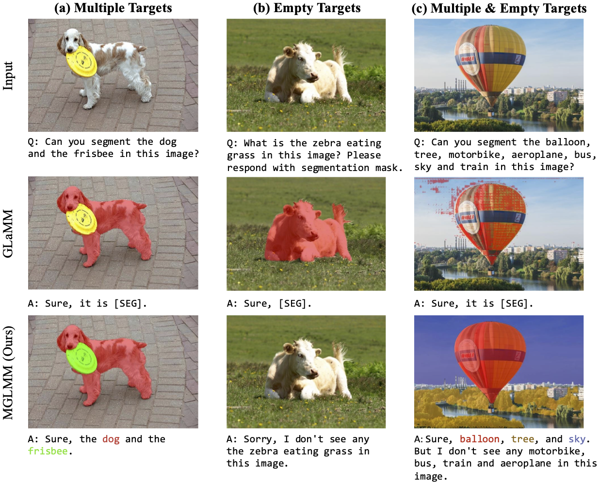

# Instruction-guided Multi-Granularity Segmentation and Captioning with Large Multimodal Model
<p align="center">
    
</p>

#### Li Zhou\*, Xu Yuan\*, Zenghui Sun, Zikun Zhou, Jinsong Lan
\* Equally contributing first authors


#### **Mohamed bin Zayed University of AI, Australian National University, Aalto University, Carnegie Mellon University, University of California - Merced, Linköping University, Google Research**
[]()
[]()
[](https://lizhou-cs.github.io/mglmm.github.io)
[](https://arxiv.org/abs/2311.03356)

---

## 📢 Latest Updates

- 🌟 **Featured**: We will release the MGLMM demo, code and datasets as soon as possible. 🌟

---

##  MGLMM Overview

<!-- Large Multimodal Models (LMMs) have achieved significant progress by extending large language models. Building on this progress, the latest developments in LMMs demonstrate the ability to generate dense pixel-wise segmentation through the integration of segmentation models.  -->
The textual responses and segmentation masks of existing works remain at the instance level, showing limited ability to perform fine-grained understanding and segmentation even provided with detailed textual cues.
To overcome this limitation, we introduce a Multi-Granularity Large Multimodal Model (MGLMM), which is capable of seamlessly adjusting the granularity of Segmentation and Captioning (SegCap) following user instructions, from panoptic SegCap to fine-grained SegCap. 
We name such a new task Multi-Granularity Segmentation and Captioning (MGSC). Observing the lack of a benchmark for model training and evaluation over the MGSC task, we establish a benchmark with aligned masks and captions in multi-granularity using our customized automated annotation pipeline. This benchmark comprises 10K images and more than 30K image-question pairs.
 We will release our dataset along with the implementation of our automated dataset annotation pipeline for further research.Besides, we propose a novel unified SegCap data format to unify heterogeneous segmentation datasets; it effectively facilitates learning to associate object concepts with visual features during multi-task training. 
 <!-- Extensive experiments demonstrate that our MGLMM excels at tackling more than eight downstream tasks and achieves state-of-the-art performance in MGSC, GCG, image captioning, referring segmentation, multiple and empty segmentation, and reasoning segmentation tasks.  -->
 <!-- The great performance and versatility of MGLMM underscore its potential impact on advancing multimodal research. -->

<p align="center">
  
</p>


---

## 🏆 Contributions

- **MGLMM Introduction.** We propose multi-granularity large multimodal model (MGLMM), the first model capable of seamlessly switching between multi-granularity segmentation and captioning, especially including panoptic and fine-grained segmentation and captioning. MGLMM achieves state-of-the-art performance on multi downstream tasks.

- **Novel Task & Evaluation.** We introduce a novel benchmark MGSCData to train and evaluate the ability of multi-granularity segmentation and captioning for LMMs, which comprises over 30K high-quality image-question pairs.

- **Unify Data Format.** We propose a unified data format, which facilitates learn- ing the alignment relationships between object concepts and segmentation masks in multiple granularities.

---

## 👁️💬 MGLMM: Multi-granularity Large Multimodal Model
The left side of the figure illustrates the model architecture of MGLMM, and the right side illustrates the proposed unified data format for multi-task learning.

<p align="center">
  
</p>

---

## 💡 Motivatation
Figure left shows such a case where GLaMM overlooks the tennis racket, tennis ball and microphone in both mask and text responses. Besides, these models only possess the ability to describe the image at the instance level and produce corresponding instance masks aligned with the output texts. Hence, these models can hardly perceive the fine-grained objects, such as the hat, wristband, and skirt of the player in Figure right, even provided with detailed textual cues. The missing of the above abilities would limit the universality and comprehension of the LMMs.

<p align="center">
  
</p>

---

## 🔍 Multi-granlarity Segmentation and Captioning Dataset (MGSCData)

We annotate 10K SAM images, which are inherently diverse and exhibit multi-granularity. The resulting dataset comprises 30K conversations and contains over 45M tokens, totaling more than 300K segmentation masks, each accompanied by a short semantic label and a detailed caption. 

<p align="center">
  
</p>
<!-- --- -->

## 🚀 Qualitative results

### 📷 Multi-Granularity Segmentation and Captioning

Comparing favorably to specialized models, GLaMM provides high-quality image captioning.

<p align="center">
  
</p>

---

### 📷 Grounded Conversation Generation 

Comparing favorably to specialized models, GLaMM provides high-quality image captioning.

<p align="center">
  
</p>

<!-- --- -->

### 🎯 Referring Expression Segmentation

Our model excels in creating segmentation masks from fine-grained objects.

<p align="center">
  
</p>

<!-- <p align="center">
  
</p> -->

---

### 🖼️ Empty and Multiple Segmentation

GLaMM generates detailed region-specific captions and answers reasoning-based visual questions.

<p align="center">
  
</p>

<!-- <p align="center">
  
</p> -->

---

<!-- ### 📷 Image Captioning

Comparing favorably to specialized models, GLaMM provides high-quality image captioning.

<p align="center">
  
</p>

--- -->

<!-- ## 💬 Conversational Style Question Answering

GLaMM demonstrates its prowess in engaging in detailed, region-specific, and grounded conversations. This effectively highlights its adaptability in intricate visual-language interactions and robustly retaining reasoning capabilities inherent to LLMs.

<p align="center">
  
</p>

---

<p align="center">
  
</p>

--- -->

## 📜 Citation
```bibtex
  @article{hanoona2023GLaMM,
          title={GLaMM: Pixel Grounding Large Multimodal Model},
          author={Rasheed, Hanoona and Maaz, Muhammad and Shaji, Sahal and Shaker, Abdelrahman and Khan, Salman and Cholakkal, Hisham and Anwer, Rao M. and Xing, Eric and Yang, Ming-Hsuan and Khan, Fahad S.},
          journal={The IEEE/CVF Conference on Computer Vision and Pattern Recognition},
          year={2024}
  }
```

---
## 🙏 Acknowledgement
We are thankful to LLaVA, LISA, and GLaMM for releasing their models and code as open-source contributions.


<!-- ---
[](https://www.ival-mbzuai.com)
[](https://github.com/mbzuai-oryx)
[](https://mbzuai.ac.ae) -->
