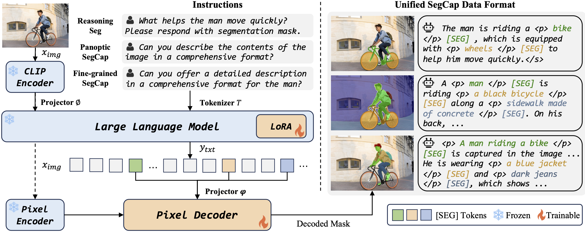
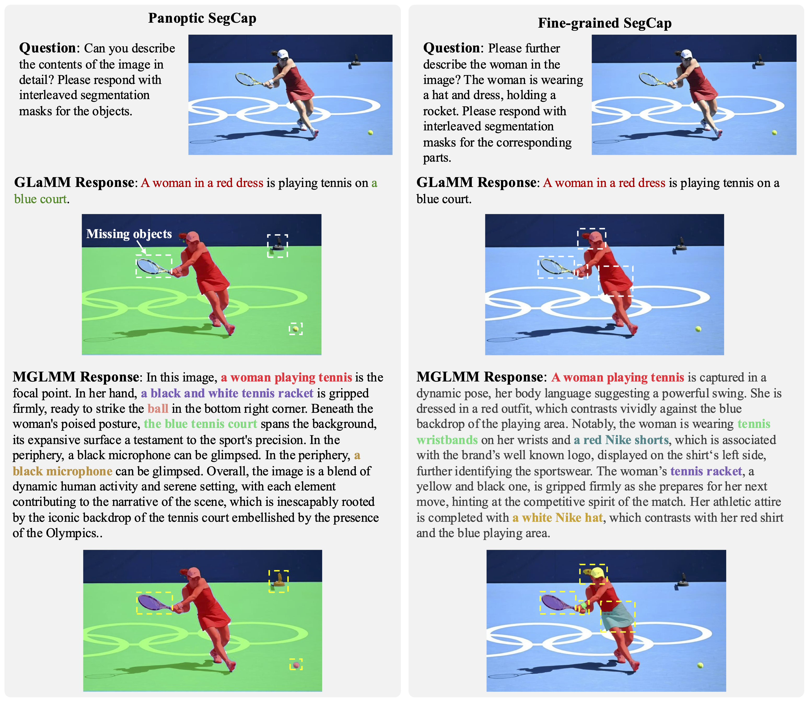
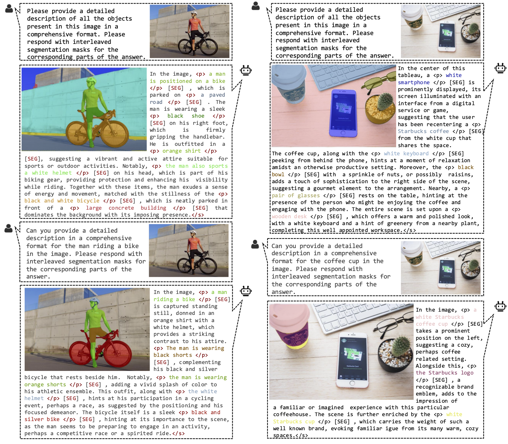
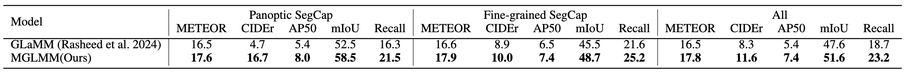
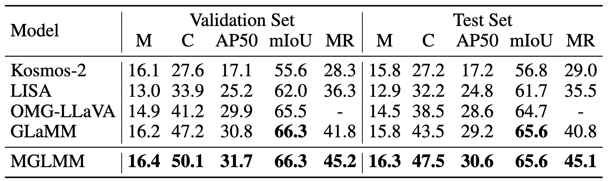
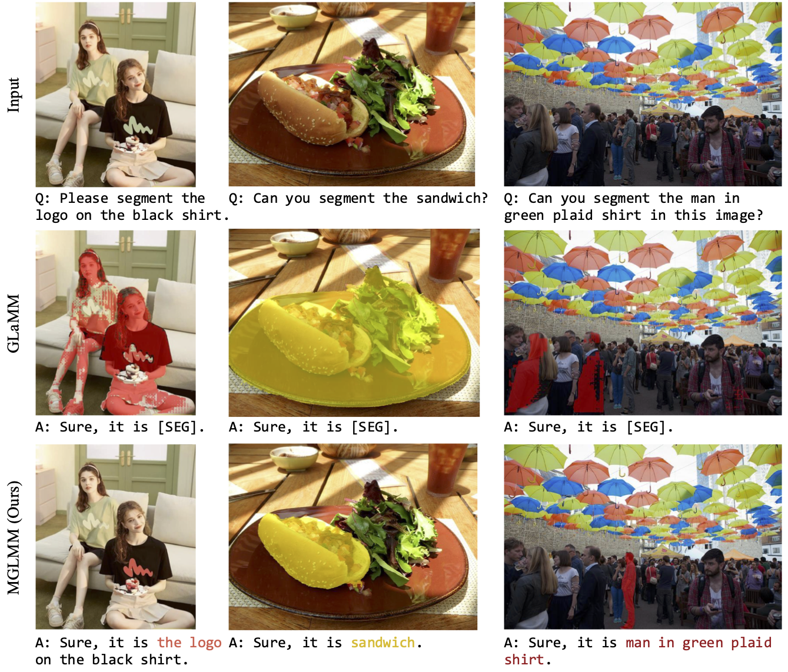
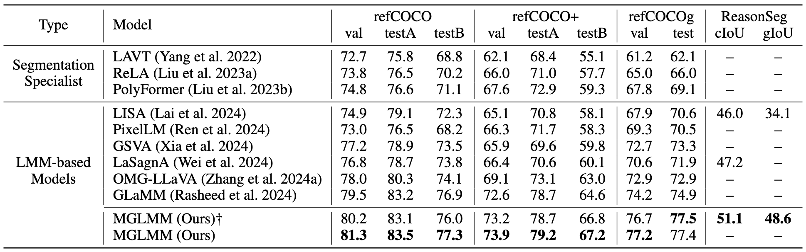
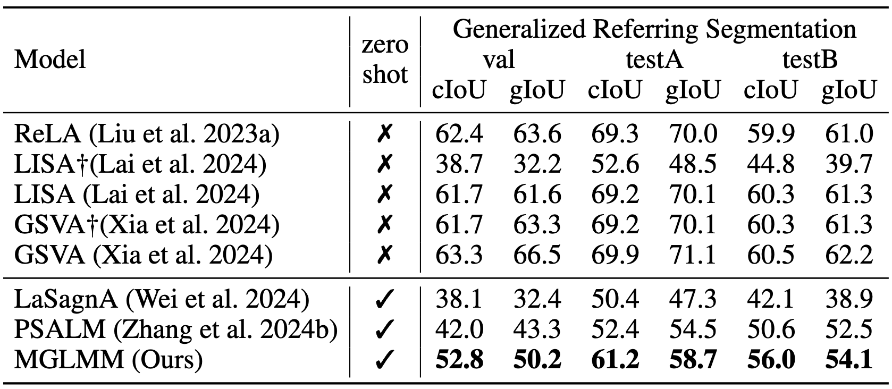
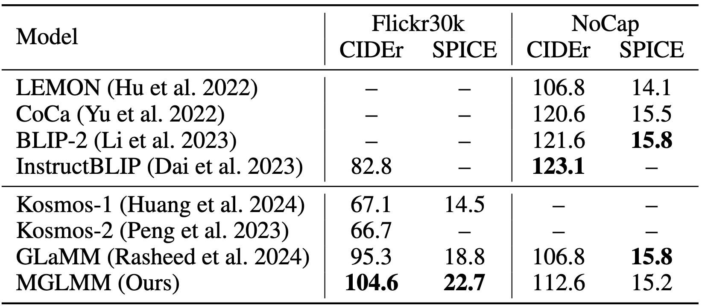

# [AAAI'25] Instruction-guided Multi-Granularity Segmentation and Captioning with Large Multimodal Model
<p align="center">
  
</p>

<div align="center">

**Xu Yuan\*, Li Zhou\*, Zenghui Sun, Zikun Zhou, and Jinsong Lan**

**The Hong Kong Polytechnic University, TAO Technology of Alibaba Group, and Peng Cheng Laboratory**

\* Joint first author & Equal contribution

[](https://arxiv.org/abs/2409.13407)
[](https://lizhou-cs.github.io/mglmm.github.io)
[](https://lizhou-cs.github.io/mglmm.github.io)

</div>

---

## 🚀 Running Instructions

### 1. Environment Setup

Create a fresh Python environment and install the Python dependencies:

```bash
conda create -n mglmm python=3.10 -y
conda activate mglmm

pip install -r requirements.txt
```

Install PyTorch separately according to your CUDA version. For example:

```bash
pip install torch torchvision --index-url https://download.pytorch.org/whl/cu118
```

Set the repository on `PYTHONPATH`:

```bash
export PYTHONPATH="$(pwd):${PYTHONPATH:-}"
```

Optional OSS support:

```bash
pip install oss2
export LOAD_DATA_FROM_OSS=1
export OSS_ACCESS_ID=<your-access-key-id>
export OSS_ACCESS_KEY=<your-access-key-secret>
export OSS_BUCKET=<your-bucket>
export OSS_ENDPOINT=<your-endpoint>
```

Leave `LOAD_DATA_FROM_OSS` unset for normal local-file training and evaluation.

### 2. Checkpoints

Prepare the model and vision checkpoints before running training or inference:

```text
checkpoints/
├── llava-llama-2-13b-chat-lightning-preview/
├── sam_vit_h_4b8939.pth
└── mglmm/                         # merged or released MGLMM checkpoint
```

Common paths used by the scripts:

```bash
export VERSION=./checkpoints/llava-llama-2-13b-chat-lightning-preview
export VISION_TOWER=openai/clip-vit-large-patch14-336
export VISION_PRETRAINED=./checkpoints/sam_vit_h_4b8939.pth
export MODEL_PATH=./checkpoints/mglmm
```

### 3. Data Layout

The public scripts expect datasets under `./data` by default. You can also set
`DATASET_DIR=/path/to/data`.

Recommended layout:

```text
data/
├── coco/
├── RefCoco_Reg/
├── refcoco/
├── refcoco+/
├── refcocog/
├── GranDf/
├── MGLMM_gcg_new/
├── SegmentAnything/
├── flickr_30k/
├── visual_genome/
├── nocaps/
├── ade20k/
├── cocostuff/
├── vlpart/
└── cocopanoptic/
```

Only the datasets required by the task you run need to be present. For example,
referring segmentation mainly needs the RefCOCO-family data, while GCG evaluation
uses `GranDf`.

### 4. Fine-Tuning

Use `run_finetune.sh` for local DeepSpeed training. The script supports
`TASK=cap`, `TASK=seg`, and `TASK=gcg`.

Referring segmentation fine-tuning:

```bash
TASK=seg \
NUM_GPUS=1 \
VERSION="$VERSION" \
VISION_TOWER="$VISION_TOWER" \
VISION_PRETRAINED="$VISION_PRETRAINED" \
DATASET_DIR=./data \
CKPT_BASE_DIR=./output/checkpoints \
LOG_BASE_DIR=./output/logs \
EXP_NAME=mglmm_seg \
bash run_finetune.sh
```

Caption fine-tuning:

```bash
TASK=cap \
NUM_GPUS=1 \
VERSION="$VERSION" \
VISION_PRETRAINED="$VISION_PRETRAINED" \
DATASET_DIR=./data \
EXP_NAME=mglmm_cap \
bash run_finetune.sh
```

GCG fine-tuning:

```bash
TASK=gcg \
NUM_GPUS=1 \
VERSION="$VERSION" \
VISION_PRETRAINED="$VISION_PRETRAINED" \
DATASET_DIR=./data \
EXP_NAME=mglmm_gcg \
bash run_finetune.sh
```

Useful knobs:

```bash
export BATCH_SIZE=2
export GRAD_STEPS=1
export EPOCHS=5
export STEPS_PER_EPOCH=500
export LR=2e-4
export WORKERS=8
```

### 5. Merge LoRA Weights

After DeepSpeed training, convert a ZeRO checkpoint to a Hugging Face checkpoint:

```bash
CKPT_BASE_DIR=./output/checkpoints \
bash scripts/extract_hf_weights.sh mglmm_seg
```

The merged checkpoint is written to:

```text
output/pretrained/mglmm_seg/
```

### 6. Interactive Inference

Run the demo-style inference entry:

```bash
MODEL_PATH=./output/pretrained/mglmm_seg \
bash run_inference.sh --interactive
```

Output files are written to:

```text
output/vis_output/
output/masks/
```

Batch inference over local GranD-f or MGSC-style images:

```bash
MODEL_PATH=./output/pretrained/mglmm_seg \
bash run_inference.sh \
  --grandf_image_dir ./data/GranDf/annotations/val_test
```

For MGSC batch inference, pass the MGSC annotation and image roots:

```bash
MODEL_PATH=./output/pretrained/mglmm_seg \
bash run_inference.sh \
  --mgsc_annotation_dir ./data/MGLMM_gcg_new/annotations \
  --mgsc_image_dir ./data/SegmentAnything/imgs
```

### 7. Evaluation

Referring segmentation:

```bash
DATASET_DIR=./data \
bash eval/referring_seg/run_evaluation.sh \
  ./output/pretrained/mglmm_seg \
  ./output/results/referring_seg
```

GCG:

```bash
DATASET_DIR=./data \
BERT_MODEL_PATH=bert-base-uncased \
bash eval/gcg/run_evaluation.sh \
  ./output/pretrained/mglmm_gcg \
  ./output/results/gcg
```

MGSC:

```bash
DATASET_DIR=./data \
BERT_MODEL_PATH=bert-base-uncased \
bash eval/mgsc/run_evaluation.sh \
  ./output/pretrained/mglmm_gcg \
  ./output/results/mgsc
```

Region captioning:

```bash
DATA_DIR=./data \
bash eval/region_captioning/run_evaluation.sh \
  mglmm_cap \
  ./output/results/caption/mglmm_cap
```

### 8. MGSC Data Conversion

To convert local MGSC annotations into the evaluation format:

```bash
python mgscdata/convert.py \
  --mgsc_annotations ./data/MGLMM_gcg_new/annotations \
  --split_file ./data/MGLMM_gcg_new/annotations/MGLMM_val_split.txt \
  --image_source_dir ./data/SegmentAnything/imgs \
  --annotation_save_dir ./data/MGLMM_gcg_new/evaluation/annotations \
  --image_save_dir ./data/MGLMM_gcg_new/evaluation/images
```

### 9. Troubleshooting

- If `oss2` is missing, make sure `LOAD_DATA_FROM_OSS` is unset unless you really
  want to load data from OSS.
- If a dataset file is not found, check that `DATASET_DIR` points to the parent
  directory containing the dataset folders shown above.
- If CUDA memory is insufficient, lower `BATCH_SIZE`, increase `GRAD_STEPS`, or
  reduce `NUM_GPUS`/model size according to your hardware.
- If DeepSpeed cannot find the project modules, run
  `export PYTHONPATH="$(pwd):${PYTHONPATH:-}"` from the repository root.

---

## 💬 MGLMM Overview

The pixel-wise understanding capability of existing Large Multimodal Models (LMMs) remains at the instance level, showing the limited ability to generate fine-grained textual responses and segmentation masks even provided with detailed instruction cues.
To overcome this limitation, we introduce a Multi-Granularity Large Multimodal Model (MGLMM), which is capable of seamlessly adjusting the granularity of Segmentation and Captioning (SegCap) following user instructions, from panoptic SegCap to fine-grained SegCap. 
We name such a new task Multi-Granularity Segmentation and Captioning (MGSC). Observing the lack of a benchmark for model training and evaluation over the MGSC task, we establish a benchmark with aligned masks and captions in multi-granularity using our customized automated annotation pipeline. This benchmark comprises 10K images and more than 30K image-question pairs.
We will release our dataset along with the implementation of our automated dataset annotation pipeline for further research. Besides, we propose a novel unified SegCap data format to unify heterogeneous segmentation datasets; it effectively facilitates learning to associate object concepts with visual features during multi-task training. 

<p align="center">
  
</p>

---

## 🏆 Contributions

- **MGLMM Introduction.** We propose the Multi-Granularity Large Multimodal Model (MGLMM), the first model capable of seamlessly switching between multi-granularity segmentation and captioning, mainly including panoptic and fine-grained segmentation and captioning. MGLMM achieves state-of-the-art performance on multiple downstream tasks.

- **Novel Task & Evaluation.** We introduce a novel benchmark MGSCData to train and evaluate the ability of multi-granularity segmentation and captioning for LMMs, which comprises over 30K high-quality image-question pairs.

- **Unify Data Format.** We propose a unified data format, which facilitates learning the alignment relationships between object concepts and segmentation masks in multiple granularities.

---

## 👁️ MGLMM: Multi-granularity Large Multimodal Model
The left side of the figure illustrates the model architecture of MGLMM, and the right side illustrates the proposed unified data format for multi-task learning.

<p align="center">
  
</p>

---

### 💡 Motivation
The left figure shows a case where the previous work (e.g., GLaMM) overlooks the tennis racket, tennis ball, and microphone in mask and text responses. Besides, these models only possess the ability to describe the image at the instance level and produce corresponding instance masks aligned with the output texts. Hence, these models can hardly perceive the fine-grained objects, such as the player's hat, wristband, and skirt in the right figure, even provided with detailed textual cues. The missing of the above abilities would limit the universality and comprehension of the LMMs.

<p align="center">
  
</p>

---

### 🔍 Multi-granlarity Segmentation and Captioning Dataset (MGSCData)

We annotate 10K SAM images, which are inherently diverse and exhibit multi-granularity. The resulting dataset comprises 30K conversations and contains over 45M tokens, totaling more than 300K segmentation masks, each accompanied by a short semantic label and a detailed caption. 

<p align="center">
  
</p>
<!-- --- -->

## 🖥️ Qualitative and Quantitative results

### 📷 Multi-Granularity Segmentation and Captioning (MGSC)

The MGSC task aims to evaluate the ability of LMMs to seamlessly adjust the granularity of segmentation and captioning.

<div align="center">
  
</div>

<div align="center">
  
    <div style="display: inline-block; color: #999; padding: 2px;">
      Performance on multi-granularity segmentation and captioning. We compare our model with GLaMM using METEOR, CIDEr, AP50, mIoU, and mask recall metrics.
  </div>
</div>

---

### 📷 Grounded Conversation Generation (GCG)
The GCG task proposed by GLaMM primarily focuses on aligning the textual response with the segmentation mask at the instance level. In comparison to previous models, MGLMM provides high-quality and fine-grained captioning and segmentation results.

<div align="center">
  
</div>

<div align="center">
  
</div>

<div align="center">
  
  <div style="display: inline-block; color: #999; padding: 2px;">
      Performance on the grounded conversation generation benchmark. We report the metrics including METEOR (M), CIDEr (C), AP50, mIoU, and Mask Recall (MR).
  </div>
</div>

---
<!-- --- -->

### 🎯 Referring Expression Segmentation

Our model is also an expert at the traditional referring segmentation task, i.e., producing corresponding segmentation masks based on the provided referring expressions.

<div align="center">

</div>

<div align="center">
  
  <div style="display: inline-block; color: #999; padding: 2px;">
    Performance on referring and reasoning segmentation benchmarks. The table only shows the cIoU values for referring segmentation.
  </div>
</div>

---

### 🖼️ Multiple and Empty Segmentation

MGLMM features the ability to segment multiple targets and reject empty targets, outperforming all competitive models in zero-shot scenarios.

<div align="center">
  
</div>

<div align="center">
  
  <div style="display: inline-block; color: #999; padding: 2px;">
    Performance comparison on generalized referring expression segmentation dataset, which contains multiple or empty segmentation targets.
  </div>
</div>

---

 ### 📷 Image Captioning

Our model also achieves excellent performance on the 
image-level captioning.

<div align="center">
  
  <div style="display: inline-block; color: #999; padding: 2px;">
    Performance comparison on image-level captioning.
  </div>
</div>

## 📜 Citation
```bibtex
@inproceedings{yuan2025instruction,
  title={Instruction-guided multi-granularity segmentation and captioning with large multimodal model},
  author={Yuan, Xu and Zhou, Li and Sun, Zenghui and Zhou, Zikun and Lan, Jinsong},
  booktitle={Proceedings of the AAAI Conference on Artificial Intelligence},
  volume={39},
  number={9},
  pages={9725--9733},
  year={2025}
}
```

---
## 🙏 Acknowledgement
We are thankful to [LLaVA](https://github.com/haotian-liu/llava), [LISA](https://github.com/JIA-Lab-research/LISA), and [GLaMM](https://github.com/mbzuai-oryx/groundingLMM) for releasing their models and code as open-source contributions.
